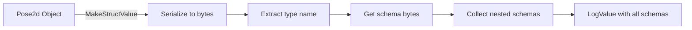

# Struct Logging

TelemetryKit supports WPILib struct serialization with automatic schema publishing to NetworkTables and WPILog files.

!!! warning "Beta Feature"
    Struct logging is in beta. Some structs may not work correctly. Use the helper functions (e.g., `LogPose2d()`, `LogSwerveModuleStates()`) for more reliable decomposed logging. <!-- (1)! -->

Helper functions decompose structs into individual primitive fields, avoiding serialization issues and providing better dashboard compatibility.

## Quick Start

```cpp
#include <frc/geometry/Pose2d.h>
#include <telemetrykit/TelemetryKit.h>

// Log a Pose2d
frc::Pose2d robotPose{1.5_m, 2.3_m, frc::Rotation2d{45_deg}};
tkit::Logger::RecordOutput("Odometry/Pose", tkit::MakeStructValue(robotPose));

// Log an array of SwerveModuleStates
std::array<frc::SwerveModuleState, 4> moduleStates = {...};
tkit::Logger::RecordOutput("Drive/ModuleStates",
  tkit::MakeStructArrayValue(std::span(moduleStates)));
```

TelemetryKit automatically publishes struct schemas to NetworkTables and encodes them correctly in WPILog files.

## How It Works

### Serialization

When you call `MakeStructValue()`, TelemetryKit:

1. Serializes the struct to bytes using `wpi::Struct`
2. Extracts the type name (e.g., "Pose2d")
3. Collects schema bytes using `wpi::GetStructSchemaBytes<T>()`
4. Gathers nested struct schemas (e.g., Translation2d, Rotation2d for Pose2d)



### Schema Publishing

#### NetworkTables

When `NetworkTablesReceiver` encounters a struct for the first time:

```cpp
// Publishes schemas for Pose2d and its nested structs
m_inst.AddSchema("Pose2d", "structschema", pose2dSchemaBytes);
m_inst.AddSchema("Translation2d", "structschema", translation2dSchemaBytes);
m_inst.AddSchema("Rotation2d", "structschema", rotation2dSchemaBytes);

// Then publishes the data as a RawTopic
auto topic = m_inst.GetRawTopic("/Odometry/Pose");
auto publisher = topic.Publish("Pose2d");  // (1)!
publisher.Set(serializedBytes, timestamp);
```

1. The type string "Pose2d" tells NT4 clients which schema to use for deserialization

#### WPILog Files

`WPILogWriter` creates log entries with the correct type string:

```cpp
// Creates entry with "struct:Pose2d" type
int entryId = m_log->Start("/Odometry/Pose", "struct:Pose2d");

// Appends serialized bytes
m_log->AppendRaw(entryId, serializedBytes, timestamp);
```

Tools like AdvantageScope can then deserialize the struct data for visualization.

## Nested Struct Dependencies

TelemetryKit automatically handles nested struct dependencies using `wpi::ForEachStructSchema<T>()`:

```cpp
// When you log a Pose2d
tkit::MakeStructValue(pose);

// TelemetryKit collects schemas for:
// - Pose2d (the main struct)
// - Translation2d (nested in Pose2d)
// - Rotation2d (nested in Pose2d)
```

Without nested schemas, clients cannot deserialize structs that contain other structs. With nested schemas, clients receive all required schemas for full deserialization.

## Supported Structs

Any WPILib struct that implements `wpi::Struct<T>` is supported:

### Geometry Structs

```cpp
#include <frc/geometry/Pose2d.h>
#include <frc/geometry/Pose3d.h>
#include <frc/geometry/Translation2d.h>
#include <frc/geometry/Translation3d.h>
#include <frc/geometry/Rotation2d.h>
#include <frc/geometry/Rotation3d.h>
#include <frc/geometry/Transform2d.h>
#include <frc/geometry/Transform3d.h>

tkit::Logger::RecordOutput("Pose2D", tkit::MakeStructValue(pose2d));
tkit::Logger::RecordOutput("Pose3D", tkit::MakeStructValue(pose3d));
```

### Kinematics Structs

```cpp
#include <frc/kinematics/SwerveModuleState.h>
#include <frc/kinematics/SwerveModulePosition.h>
#include <frc/kinematics/ChassisSpeeds.h>

tkit::Logger::RecordOutput("ModuleStates",
  tkit::MakeStructArrayValue(moduleStates));
```

### Custom Structs

You can use any custom struct that implements `wpi::Struct<T>`:

```cpp
// Your custom struct with wpi::Struct implementation
struct CustomData {
  double value1;
  int value2;

  using StructType = wpi::Struct<CustomData>;
  static constexpr std::string_view GetTypeName() { return "CustomData"; }
  // ... implement required methods
};

CustomData data{1.5, 42};
tkit::Logger::RecordOutput("Custom", tkit::MakeStructValue(data));
```

## Struct Helper Functions

For dashboard visibility, TelemetryKit provides helpers to decompose structs into individual fields:

```cpp
#include <telemetrykit/core/StructLogger.h>

frc::Pose2d pose{1.5_m, 2.3_m, frc::Rotation2d{45_deg}};

// Instead of logging as a binary struct
tkit::Logger::RecordOutput("Pose", tkit::MakeStructValue(pose));

// Decompose into individual fields for plotting
auto& table = tkit::Logger::GetTable();
tkit::LogPose2d(table, "Pose", pose);
// Creates:
//   "Pose/X" -> 1.5
//   "Pose/Y" -> 2.3
//   "Pose/Rotation" -> 0.785398 (45° in radians)
```

Available helpers:

| Function | Struct Type | Fields Created |
|----------|-------------|----------------|
| `LogPose2d` | `frc::Pose2d` | X, Y, Rotation |
| `LogPose3d` | `frc::Pose3d` | X, Y, Z, Rotation (Quaternion) |
| `LogTranslation2d` | `frc::Translation2d` | X, Y |
| `LogTranslation3d` | `frc::Translation3d` | X, Y, Z |
| `LogSwerveModuleState` | `frc::SwerveModuleState` | Speed, Angle |
| `LogSwerveModulePosition` | `frc::SwerveModulePosition` | Distance, Angle |
| `LogSwerveModuleStates` | `std::vector<...>` | Module0/..., Module1/..., etc. |

Use structs for full type preservation in AdvantageScope. Use helpers for individual fields that can be plotted on dashboards.

## Performance Considerations

### Serialization Overhead

Struct serialization has minimal overhead:

```cpp
frc::Pose2d pose{...};

// ~500 nanoseconds on roboRIO
auto logValue = tkit::MakeStructValue(pose);  // (1)!
```

1. Includes serialization, schema lookup, and LogValue construction

### Schema Publishing

Schemas are only published once per struct type:

```cpp
// First Pose2d - publishes schemas
tkit::Logger::RecordOutput("Pose1", tkit::MakeStructValue(pose1));
tkit::Logger::Periodic();  // → Publishes 3 schemas

// Second Pose2d - skips schema publishing
tkit::Logger::RecordOutput("Pose2", tkit::MakeStructValue(pose2));
tkit::Logger::Periodic();  // → Only publishes data
```

Schema publishing is a one-time cost per struct type, not per value.

## Examples

### Complete Swerve Drive Telemetry

```cpp
#include <telemetrykit/TelemetryKit.h>
#include <telemetrykit/core/StructLogger.h>
#include <frc/kinematics/SwerveModuleState.h>

class SwerveDrive {
 public:
  void UpdateTelemetry() {
    auto& table = tkit::Logger::GetTable();

    // Log robot pose (full struct for AdvantageScope)
    tkit::Logger::RecordOutput("Swerve/Pose",
      tkit::MakeStructValue(m_poseEstimator.GetEstimatedPosition()));

    // Log module states (decomposed for dashboard)
    tkit::LogSwerveModuleStates(table, "Swerve/ModuleStates", m_moduleStates);

    // Log as struct array for AdvantageScope
    tkit::Logger::RecordOutput("Swerve/ModuleStatesStruct",
      tkit::MakeStructArrayValue(std::span(m_moduleStates)));
  }

 private:
  std::array<frc::SwerveModuleState, 4> m_moduleStates;
  frc::SwerveDrivePoseEstimator m_poseEstimator;
};
```

This creates the following NT4 topics and log entries:

```
/Swerve/Pose                            → Pose2d struct
/Swerve/ModuleStates/Module0/Speed      → double
/Swerve/ModuleStates/Module0/Angle      → double
/Swerve/ModuleStates/Module1/Speed      → double
/Swerve/ModuleStates/Module1/Angle      → double
...
/Swerve/ModuleStatesStruct              → SwerveModuleState[] struct array
```

---

[Learn More About Receivers →](../receivers/overview.md){ .md-button }
