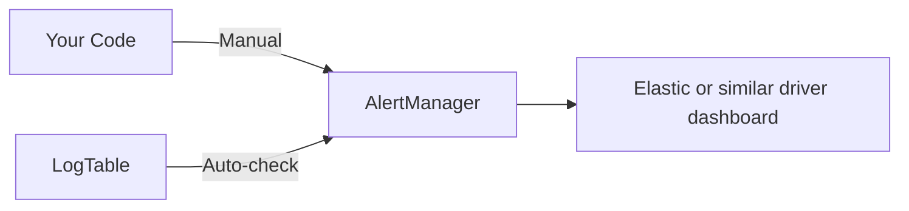

# AlertManager

The AlertManager provides a centralized way to create and manage Driver Station alerts. It wraps WPILib's `frc::Alert` system and adds support for auto-checked alerts that monitor logged values.

## Overview

AlertManager supports two types of alerts:

- **Manual alerts** - Turned on/off directly by your code
- **Auto-checked alerts** - Automatically trigger based on logged values



## Manual Alerts

Manual alerts are the simplest form - you control when they appear and disappear.

```cpp
auto& alerts = tkit::AlertManager::GetInstance();

// Show alerts
alerts.Info("calibration", "Gyro calibrating...");
alerts.Warning("battery", "Battery below 11V");
alerts.Error("motor", "Motor 3 not responding");

// Clear an alert (pass false)
alerts.Warning("battery", "Battery below 11V", false);

// Or remove it completely
alerts.ClearManualAlert("battery");
```

Each alert is identified by a unique key. If you call the same key twice, it updates the existing alert rather than creating a new one.

### Alert Types

| Method | Severity | Use For |
|--------|----------|---------|
| `Info()` | Low | Status updates, calibration progress |
| `Warning()` | Medium | Degraded performance, approaching limits |
| `Error()` | High | Failures, safety-critical issues |

## Auto-Checked Alerts

Auto-checked alerts monitor values in your LogTable and trigger automatically when conditions are met. They are evaluated automatically during `Logger::Periodic()`.

### Threshold Alerts

Trigger when a value goes above or below a threshold:

```cpp
auto& alerts = tkit::AlertManager::GetInstance();

// Alert when battery drops below 11V
alerts.AddThresholdAlert(
    "Power/BatteryVoltage",           // Log key to monitor
    "Low battery voltage!",            // Alert message
    11.0,                              // Threshold
    tkit::AlertCondition::kBelow,     // Trigger when below
    frc::Alert::AlertType::kWarning   // Severity (optional, defaults to Warning)
);

// Alert when motor temperature exceeds 80C
alerts.AddThresholdAlert(
    "DriveTrain/MotorTemp",
    "Motor overheating!",
    80.0,
    tkit::AlertCondition::kAbove,
    frc::Alert::AlertType::kError
);
```

### Range Alerts

Trigger when a value leaves an allowed range:

```cpp
// Alert if arm angle is outside safe operating range
alerts.AddRangeAlert(
    "Arm/Angle",
    "Arm angle out of safe range!",
    -45.0,   // Min allowed
    90.0,    // Max allowed
    frc::Alert::AlertType::kWarning
);
```

### Change Alerts

Trigger when a value differs from an expected value:

```cpp
// Alert if drive mode changes unexpectedly
alerts.AddOnChangeAlert(
    "DriveTrain/Mode",
    "Drive mode changed!",
    0.0,  // Expected value (0 = normal mode)
    frc::Alert::AlertType::kInfo
);

// Works with booleans too
alerts.AddOnChangeAlert(
    "Intake/BeamBreak",
    "Game piece detected",
    false,  // Expected state
    frc::Alert::AlertType::kInfo
);
```

## Clearing Alerts

```cpp
auto& alerts = tkit::AlertManager::GetInstance();

// Clear a specific manual alert
alerts.ClearManualAlert("battery");

// Clear auto-checked alerts for a log key
alerts.ClearAutoAlert("Power/BatteryVoltage");

// Clear all manual alerts
alerts.ClearAllManualAlerts();

// Clear all auto-checked alerts
alerts.ClearAllAutoAlerts();

// Clear everything
alerts.Clear();
```

## Supported Value Types

Auto-checked alerts work with these logged value types:

| LogType | Behavior |
|---------|----------|
| `double` | Threshold and change alerts |
| `float` | Threshold and change alerts |
| `int64` | Threshold and change alerts |
| `bool` | Change alerts (use boolean overload) |
| `string` | Change alerts (equality comparison) |
| `arrays` | Change alerts (element-wise comparison) |

!!! warning "Unsupported Types"
    Structs cannot be auto-checked. Use manual alerts for these.
