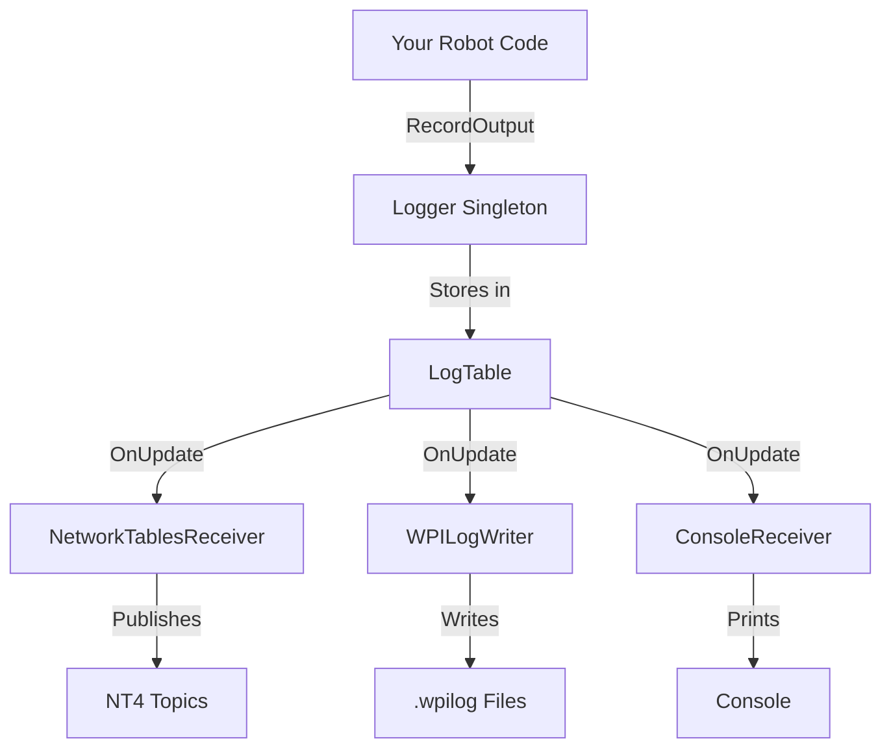
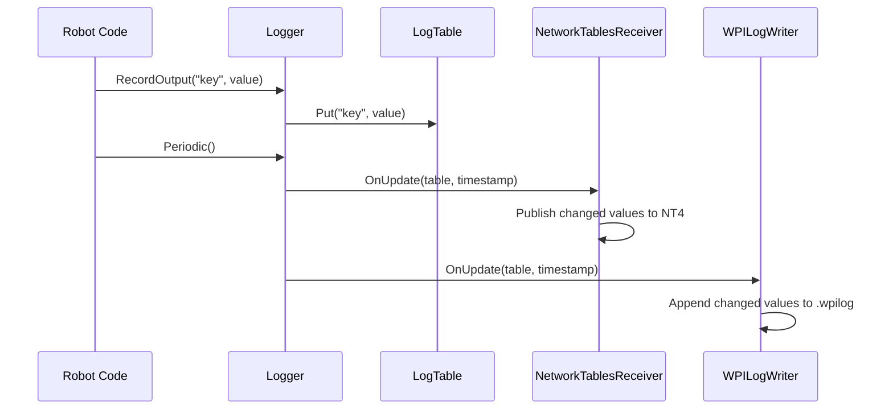

# Core Concepts

TelemetryKit has three main components: Logger, LogValue, and Receivers.

## Architecture Overview



## Components

### 1. Logger

Singleton that manages the logging lifecycle and distributes data to receivers.

```cpp
auto& logger = tkit::Logger::GetInstance();  // (1)!

// Lifecycle management
logger.Start();  // (2)!
logger.Periodic();  // (3)!
logger.End();
```

1. Returns the same singleton instance across the entire program
2. Safe to call multiple times - won't reinitialize receivers
3. **Must be called every robot cycle** to send data to receivers

Responsibilities:

- Maintains the root `LogTable` with all logged values
- Manages receiver lifecycle (`OnStart`, `OnUpdate`, `OnEnd`)
- Provides both member functions and global convenience functions
- Tracks timestamps in microseconds using FPGA timestamp

Recording data:

=== "Member Functions"

    ```cpp
    auto& logger = tkit::Logger::GetInstance();
    logger.RecordOutput("Speed", 3.5);  // (1)!
    logger.Periodic();
    ```

    1. Call methods directly on the logger instance

=== "Global Functions"

    ```cpp
    tkit::RecordOutput("Speed", 3.5);  // (1)!
    tkit::Periodic();
    ```

    1. Convenience functions that call `Logger::GetInstance()` internally

!!! tip "Choose Your Style"
    Both approaches are functionally identical - use whichever you prefer! Member functions make the singleton dependency explicit, while global functions are more concise.

### 2. LogValue

Type-safe wrapper that can hold any loggable value using `std::variant`.

Supported types:

=== "Primitives"

    ```cpp
    tkit::LogValue boolVal(true);  // (1)!
    tkit::LogValue intVal(42);
    tkit::LogValue floatVal(3.14f);
    tkit::LogValue doubleVal(2.718);
    tkit::LogValue stringVal("Hello");
    ```

    1. Type is automatically detected from the constructor argument

=== "Arrays"

    ```cpp
    std::vector<double> speeds = {1.0, 2.0, 3.0};
    tkit::LogValue arrayVal(speeds);  // (1)!

    std::vector<std::string> names = {"FL", "FR", "BL", "BR"};
    tkit::LogValue stringArray(names);
    ```

    1. Works with any `std::vector` of supported types

=== "Structs"

    ```cpp
    frc::Pose2d pose{1.5_m, 2.3_m, frc::Rotation2d{45_deg}};
    tkit::LogValue structVal = tkit::MakeStructValue(pose);  // (1)!

    // Arrays of structs
    std::vector<frc::SwerveModuleState> states = {...};
    tkit::LogValue structArray = tkit::MakeStructArrayValue(states);  // (2)!
    ```

    1. `MakeStructValue` serializes the struct and collects schemas
    2. `MakeStructArrayValue` handles arrays of structs

Runtime type information:

```cpp
LogValue value(42);

value.GetType();           // (1)!
value.Is<int64_t>();       // (2)!
value.Get<int64_t>();      // (3)!
value.GetTypeString();     // (4)!
```

1. Returns `LogType::kInt64` enum
2. Template type check - returns `true`
3. Extracts the value - returns `42`
4. Returns string representation - `"int64"`

!!! tip "Type Safety"
    Use `Is<T>()` before `Get<T>()` to avoid exceptions. Calling `Get<T>()` with the wrong type throws `std::bad_variant_access`.

### 3. Receivers

Receivers implement the `LogDataReceiver` interface and process logged data.

```cpp
class LogDataReceiver {
 public:
  virtual void OnStart() = 0;  // (1)!
  virtual void OnUpdate(const LogTable& table, int64_t timestamp) = 0;  // (2)!
  virtual void OnEnd() = 0;  // (3)!
};
```

1. Called once when `Logger::Start()` is invoked - initialize resources, open files, create NT4 publishers
2. Called every `Logger::Periodic()` - receives full table and microsecond timestamp, writes to files, publishes to NT4
3. Called when `Logger::End()` is invoked - cleanup resources, close files, flush buffers

Built-in receivers:

| Receiver | Purpose | Output |
|----------|---------|--------|
| `NetworkTablesReceiver` | Real-time dashboard viewing | NT4 topics |
| `WPILogWriter` | Post-match analysis | `.wpilog` files |
| `ConsoleReceiver` | Debugging | Console output |

## Data Flow



!!! note "Two-Phase Logging"
    Data flows in two phases: **Record** (store values in LogTable) and **Flush** (send to all receivers during `Periodic()`)

### Field-Change-Only Optimization

Both `NetworkTablesReceiver` and `WPILogWriter` implement field-change-only optimization:

```cpp
// First call - value is logged
tkit::RecordOutput("Speed", 3.5);  // (1)!
tkit::Periodic();

// Second call - same value, not logged
tkit::RecordOutput("Speed", 3.5);  // (2)!
tkit::Periodic();

// Third call - value changed, logged again
tkit::RecordOutput("Speed", 4.2);  // (3)!
tkit::Periodic();
```

1. First value recorded → receivers publish/write this value
2. Same value as before → receivers detect no change and skip processing (optimization!)
3. Value changed from 3.5 to 4.2 → receivers publish/write the new value

## Next Steps

- Learn about [LogValue](logvalue.md) in detail
- See [Units](units.md) for unit metadata and WPILib units integration
- Explore [Receivers](../receivers/overview.md) and how to configure them
- See [Struct Logging](../advanced/structs.md) for working with WPILib structs
