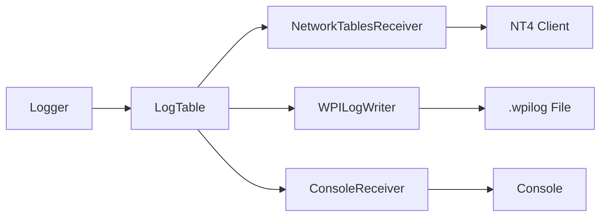

# TelemetryKit

TelemetryKit (`tkit`) is a C++ telemetry framework for FRC robots. It provides structured logging with support for NetworkTables 4, WPILog files, and console output.

## Features

- **Type-Safe** - Compile-time type checking with `std::variant` storage
- **Multiple Receivers** - Log to NT4, WPILog files, and console simultaneously
- **Struct Support** - WPILib struct serialization with automatic schema publishing
- **Unit Metadata** - Automatic unit extraction from WPILib units library for AdvantageScope
- **Field-Change-Only** - Only logs values when they change to reduce overhead

## Quick Start

### Installation

1. Open VS Code with your FRC project
2. Press `Ctrl+Shift+P` (or `Cmd+Shift+P` on Mac)
3. Type "WPILib: Manage Vendor Libraries"
4. Select "Install new libraries (online)"
5. Paste this URL:

```
https://raw.githubusercontent.com/SticksDev/TelemetryKit/refs/heads/2026/TelemetryKit.json
```

### Basic Usage

```cpp title="Robot.cpp" hl_lines="1 6-8 13 18"
#include <telemetrykit/TelemetryKit.h>

void Robot::RobotInit() {
  auto& logger = tkit::Logger::GetInstance();

  // Add receivers
  logger.AddReceiver(std::make_unique<tkit::NetworkTablesReceiver>()); // (1)!
  logger.AddReceiver(std::make_unique<tkit::WPILogWriter>("/home/lvuser/logs")); // (2)!

  logger.Start(); // (3)!
}

void Robot::RobotPeriodic() {
  auto& logger = tkit::Logger::GetInstance();

  // Log primitive values (using member functions)
  logger.RecordOutput("DriveTrain/Speed", 3.5); // (4)!
  logger.RecordOutput("DriveTrain/Enabled", true);

  // Or use global convenience functions
  tkit::RecordOutput("DriveTrain/Current", 12.5); // (5)!

  // Log structs (automatically handles schema publishing)
  frc::Pose2d pose{1.5_m, 2.3_m, frc::Rotation2d{45_deg}};
  logger.RecordOutput("RobotPose", tkit::MakeStructValue(pose)); // (6)!

  // Update logger (sends data to all receivers)
  logger.Periodic(); // (7)!
}
```

1. Publishes to NT4 for real-time viewing in Shuffleboard, Glass, or AdvantageScope
2. Writes timestamped `.wpilog` files to `/home/lvuser/logs/`
3. Initializes all receivers (calls `OnStart()` on each)
4. Logger member function - call on the logger instance
5. Global convenience function - equivalent to `Logger::GetInstance().RecordOutput(...)`
6. Serializes struct and collects all schemas (including nested Translation2d, Rotation2d)
7. Sends all logged data to receivers (calls `OnUpdate()` on each)

!!! tip "Member Functions vs Global Functions"
    Both approaches work identically - use `logger.RecordOutput(...)` for member functions or `tkit::RecordOutput(...)` for global convenience functions. Choose whichever style you prefer!

!!! important "Call Periodic() Every Cycle"
    `Logger::Periodic()` (or `tkit::Periodic()`) must be called in `RobotPeriodic()` to flush data to all receivers.

## Architecture



The Logger manages a LogTable (key-value store) and distributes updates to multiple receivers. Each receiver processes the data in its own way:

- **NetworkTablesReceiver** - Publishes to NT4 for real-time dashboard viewing
- **WPILogWriter** - Saves to .wpilog files for post-match analysis
- **ConsoleReceiver** - Prints to console for debugging

## Next Steps

- [Core Concepts](core/overview.md) - Learn about Logger, LogValue, and Receivers
- [Units](core/units.md) - Unit metadata and WPILib units integration
- [Receivers](receivers/overview.md) - Configure output destinations
- [Struct Logging](advanced/structs.md) - Working with WPILib geometry types
- [Examples](examples/basic.md) - Common usage patterns

## Design

- **Zero-copy where possible** - Minimal allocations during periodic calls
- **Field-change-only** - Only log values when they change
- **Type-safe** - Catch type errors at compile time
- **Schema-aware** - Automatic struct schema publishing for NT4 and WPILog

---

[Get Started →](core/overview.md){ .md-button .md-button--primary }
